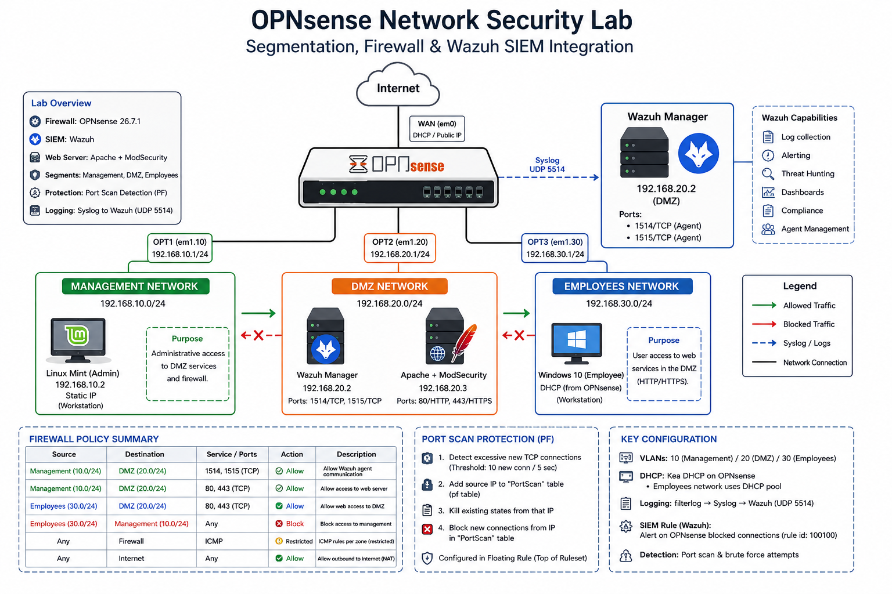

# OPNsense segmentation and Wazuh SIEM lab

A complete enterprise-style network security laboratory built with **OPNsense** and **Wazuh**, implementing **network segmentation, least-privilege firewall policies, centralized logging, and automatic port scan detection**.

This project simulates a small enterprise environment where administrative systems, internal users, and public-facing services are isolated into dedicated security zones. The firewall enforces strict inter-zone communication policies while forwarding security events to a centralized SIEM for monitoring and detection.



## Project overview

The objective of this lab was to design and implement a secure segmented network architecture using OPNsense as the perimeter and internal firewall, while integrating **Wazuh SIEM** for log collection, monitoring, and custom detection engineering.

The environment includes:

* **Management network** for administrative workstations
* **DMZ** for public-facing services
* **Employees network** for internal users
* **Centralized logging via Syslog**
* **Automatic port scan detection using PF overload tables**
* **Custom Wazuh detection rules**

## Architecture

### Network segmentation

| Security zone | Subnet          | Gateway      | Purpose                   |
| ------------- | --------------- | ------------ | ------------------------- |
| Management    | 192.168.10.0/24 | 192.168.10.1 | Administrative access     |
| DMZ           | 192.168.20.0/24 | 192.168.20.1 | Wazuh and Apache services |
| Employees     | 192.168.30.0/24 | 192.168.30.1 | Internal user endpoints   |

### Infrastructure

| Device                  | IP address   | Function                      |
| ----------------------- | ------------ | ----------------------------- |
| OPNsense Management     | 192.168.10.1 | Firewall gateway              |
| OPNsense DMZ            | 192.168.20.1 | Firewall gateway              |
| OPNsense Employees      | 192.168.30.1 | Firewall gateway              |
| Linux Mint (Management) | 192.168.10.2 | Administrative workstation    |
| Wazuh Manager           | 192.168.20.2 | SIEM platform                 |
| Apache + ModSecurity    | 192.168.20.3 | Web server and WAF            |
| Windows 10 (Employees)  | DHCP         | Internal employee workstation |

## Security controls implemented

### Network segmentation

The network is divided into three isolated security zones to reduce lateral movement and enforce security boundaries between administrative systems, internal users, and exposed services.

### Least-privilege firewall policy

Inter-zone communication is explicitly controlled through OPNsense firewall rules.

Key security policies include:

* Employees cannot access the Management network.
* Administrative access to the DMZ is explicitly permitted.
* DMZ systems cannot initiate unrestricted connections to internal networks.
* ICMP policies are applied differently for each security zone.
* Internet access is controlled through dedicated outbound rules.

### DMZ protection

The DMZ hosts:

* **Wazuh Manager**
* **Apache Web Server**
* **ModSecurity Web Application Firewall**

Access to management services is restricted to the Management network.

### Automatic port scan detection

A dedicated **floating rule** detects excessive TCP connection attempts using **PF state tracking** and **overload tables**.

When the configured threshold is exceeded:

1. The source IP is added to the **PortScan** table.
2. Existing states from that IP are terminated.
3. Subsequent connections are automatically blocked.

This provides an automated response to reconnaissance activity without requiring manual intervention.

## Centralized logging

OPNsense forwards **filterlog** events via **Syslog (UDP 5514)** to the Wazuh server.

Logging pipeline:

OPNsense (filterlog)
|
| UDP 5514
v
rsyslog
|
v
/var/log/opnsense.log
|
v
Wazuh Manager
|
v
Custom detection rules

## Wazuh integration

Wazuh was configured to:

* ingest OPNsense firewall logs,
* parse **filterlog** events,
* generate custom alerts,
* and support threat hunting and monitoring.

A custom rule (`100100`) was implemented to identify suspicious blocked network activity generated by OPNsense.

## Attack simulation

The port scan detection mechanism was validated by generating a high rate of TCP connection attempts against the DMZ web server.

Observed behavior:

* excessive connection attempts detected,
* source IP added to the **PortScan** table,
* existing states terminated,
* subsequent traffic blocked,
* firewall logs forwarded to Wazuh,
* and custom SIEM alerts generated.

Validation screenshots are available in the **screenshots/** directory.

## Repository structure

```
opnsense-wazuh-segmentation-lab/
│
├── diagrams/
├── screenshots/
├── configs/
└── docs/
```

Detailed technical documentation is available in the **docs/** directory.

## Skills demonstrated

This project demonstrates practical experience with:

* OPNsense firewall administration
* PF state tracking
* Overload tables
* Network segmentation
* Least-privilege policy design
* DMZ architecture
* Syslog integration
* Wazuh SIEM administration
* Detection engineering
* Security monitoring
* Firewall log analysis

## Lessons learned

Several real-world operational challenges were solved during the implementation of this lab, including:

* Kea DHCP configuration,
* Syslog forwarding from FreeBSD (OPNsense),
* rsyslog integration with Wazuh,
* filterlog parsing,
* PF overload table behavior,
* floating rule ordering,
* and threshold tuning for automatic blocking.

## Future improvements

Planned enhancements include:

* Suricata IDS integration,
* threat intelligence feeds,
* automated active response,
* VPN-secured management access,
* dashboard visualizations,
* and firewall configuration backup automation.

## Author

Designed and implemented by **Martí Gensana** as a practical network security and SIEM integration laboratory.
